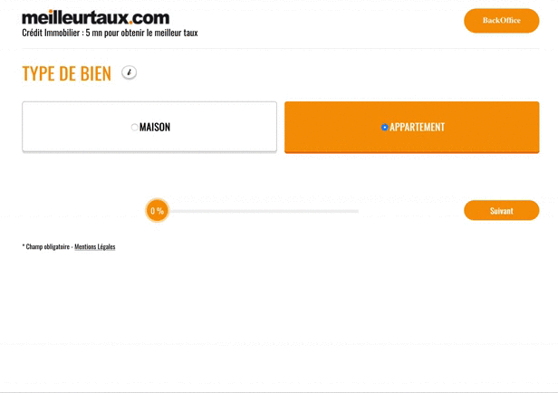

# Certif React

Reproduction d'un formulaire de demande de devis pour un emprunt immobilier sur MeilleurTaux.com

## Caractéristiques

- Utilisation de l'API VIPOCO pour gérer l'autocomplete des codes postaux : https://vicopo.selfbuild.fr/
- L'utilisateur peut avancer dans le formulaire et retourner sur les écrans précédents, sans perdre les données du formulaire.
- Tous les champs doivent être remplis et/ou sélectionnés pour pouvoir avancer à l'étape suivante, exception faite à l'étape 6 où, seul le champ dédié aux travaux peut rester vide.
- On fait apparaître une barre dynamique pour afficher la progression en pourcentage, en fonction du nombre d'étapes.
- Si l'utilisateur ferme son navigateur alors qu'il est sur le formulaire, il peut ré-ouvrir la page et retomber à l'étape en cours, sans avoir perdu aucune donnée.
- Le formulaire ne pourra pas être validé s'il n'a pas coché la case "J'accepte de recevoir par email..." sur l'écran des coordonnées.
- Une fois le formulaire validé, un mail récapitulatif sera envoyé au demandeur avec toutes les informations saisies dans le formulaire ( attention on passe par mailgun donc ça ne marche qu'avec une adresse déjà validée).
- Un backoffice permet d'administrer les demandes de devis.
